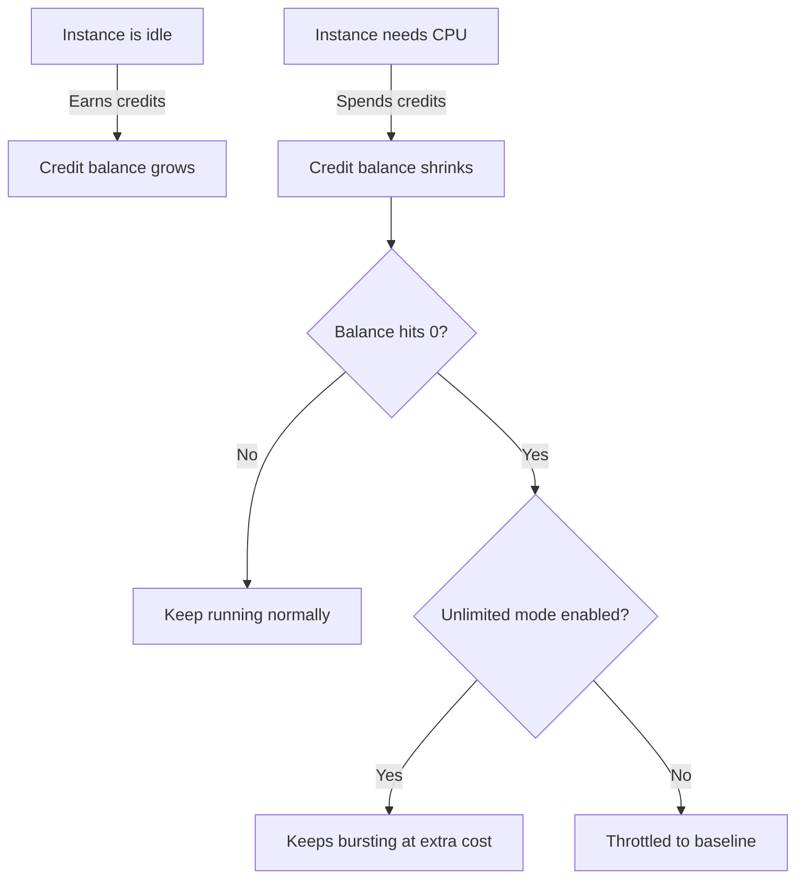
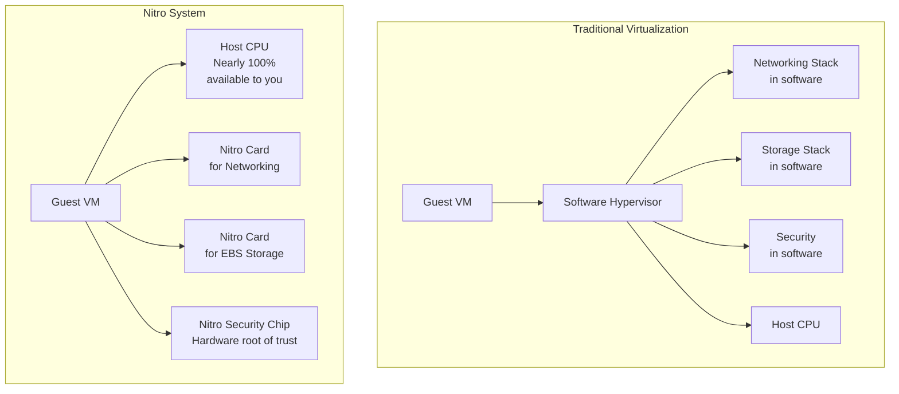
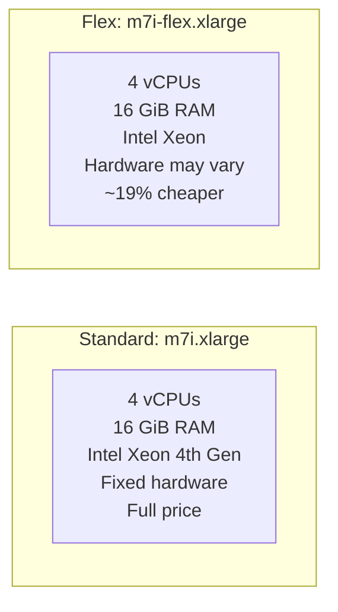
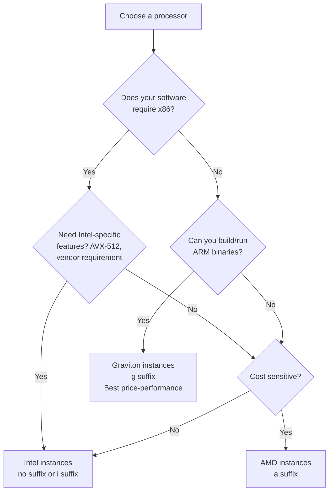

Every workload on AWS starts with a choice: which EC2 instance type? Pick wrong and you overpay for idle resources or starve your application. AWS offers hundreds of instance types across families, generations, and sizes. This guide breaks down the naming convention, walks through every family, explains the Nitro system, and covers the newer Flex instances.

<!-- truncate -->

## The Naming Convention

EC2 instance type names look cryptic: `m7g.xlarge`, `c6id.2xlarge`, `r5a.4xlarge`. But each follows a consistent pattern. Every character encodes a specific piece of information about the hardware.

The format is:

> <code>c</code> <code>7</code> <code>g</code> <code>n</code> <code>.</code> <code>2xlarge</code>
>
| Part | Value | Meaning |
 |------|-------|---------|
 | **Family** | `c` | Compute Optimized |
 | **Generation** | `7` | 7th generation hardware |
 | **Processor** | `g` | AWS Graviton (ARM) |
 | **Additional capability** | `n` | Enhanced networking |
 | **Size** | `2xlarge` | 8 vCPUs, 16 GiB memory |

Here is another example with `r7iz.metal`:

> <code>r</code> <code>7</code> <code>i</code> <code>z</code> <code>.</code> <code>metal</code>

 | Part | Value | Meaning |
 |------|-------|---------|
 | **Family** | `r` | Memory Optimized |
 | **Generation** | `7` | 7th generation hardware |
 | **Processor** | `i` | Intel Xeon |
 | **Additional capability** | `z` | High frequency |
 | **Size** | `metal` | Bare metal, all physical cores |

Not every field is present. `m7g.xlarge` and `c7i.2xlarge` have no additional capability suffix. The processor suffix is also optional: `m5.large` defaults to Intel.

### Family

The first letter tells you what the instance is optimized for. Each family targets a different balance of compute, memory, storage, and networking.

| Letter | Family | Optimized For |
|--------|--------|---------------|
| **M** | General Purpose | Balanced compute and memory |
| **T** | General Purpose (Burstable) | Variable workloads with CPU credit system |
| **C** | Compute Optimized | CPU-intensive workloads |
| **R** | Memory Optimized | Memory-intensive workloads |
| **X** | Memory Optimized | Extremely high memory-to-CPU ratio |
| **U** | Memory Optimized | High memory (up to 24 TiB) |
| **z** | Memory Optimized | High compute and high memory |
| **I** | Storage Optimized | High random I/O (NVMe SSDs) |
| **D** | Storage Optimized | High sequential I/O (HDD dense storage) |
| **H** | Storage Optimized | High throughput HDD storage |
| **Im, Is** | Storage Optimized | SSD storage with memory or storage density |
| **P** | Accelerated Computing | GPU for ML training and HPC |
| **G** | Accelerated Computing | GPU for graphics and ML inference |
| **Trn** | Accelerated Computing | AWS Trainium chips for ML training |
| **Inf** | Accelerated Computing | AWS Inferentia chips for ML inference |
| **DL** | Accelerated Computing | Deep learning with Gaudi accelerators |
| **VT** | Accelerated Computing | Video transcoding |
| **F** | Accelerated Computing | FPGA |
| **Hpc** | HPC Optimized | Tightly coupled HPC workloads |
| **Mac** | General Purpose | macOS development on Apple silicon |

### Generation

The number after the family letter indicates the generation. Higher numbers mean newer hardware. `m5` is 5th gen, `m7` is 7th gen. Newer generations deliver better price-performance. Always use the latest available generation.

### Processor

An optional letter after the generation number specifies the processor:

| Suffix | Processor | Notes |
|--------|-----------|-------|
| *(none)* | Intel Xeon (default) | When no suffix is present, the instance uses Intel |
| **a** | AMD EPYC | Typically 10% cheaper than Intel equivalents |
| **g** | AWS Graviton (ARM) | Best price-performance, up to 40% better than x86 |
| **i** | Intel (explicit) | Used when AWS wants to distinguish from Graviton |

### Additional Capabilities

One or more letters after the processor suffix indicate extra hardware features:

| Suffix | Capability |
|--------|-----------|
| **d** | Local NVMe SSD storage (instance store) |
| **n** | Enhanced networking (higher bandwidth, lower latency) |
| **e** | Extra memory (higher memory-to-CPU ratio than standard) |
| **z** | High single-thread performance (high frequency) |
| **b** | Block storage optimized (higher EBS throughput) |
| **flex** | Flex instance (flexible hardware, discussed later) |

These suffixes can combine. `c7gn` means: Compute Optimized (c), 7th generation (7), Graviton processor (g), enhanced networking (n).

### Size

The part after the dot determines how many vCPUs and how much memory you get. Sizes follow a consistent doubling pattern within a family:

| Size | Typical vCPUs | Relative Scale |
|------|--------------|----------------|
| nano | 2 | 1/16x |
| micro | 2 | 1/8x |
| small | 2 | 1/4x |
| medium | 2 | 1/2x |
| large | 2 | 1x (baseline) |
| xlarge | 4 | 2x |
| 2xlarge | 8 | 4x |
| 4xlarge | 16 | 8x |
| 8xlarge | 32 | 16x |
| 12xlarge | 48 | 24x |
| 16xlarge | 64 | 32x |
| 24xlarge | 96 | 48x |
| metal | All physical cores | Bare metal, no hypervisor |

Each step up doubles the vCPUs, memory, network bandwidth, and EBS bandwidth. If `m7g.large` has 2 vCPUs and 8 GiB of memory, `m7g.xlarge` has 4 vCPUs and 16 GiB, and `m7g.2xlarge` has 8 vCPUs and 32 GiB.

The `metal` size gives you the entire physical server. No hypervisor runs between your workload and the hardware. This is useful for workloads that require direct hardware access, licensing constraints tied to physical cores, or when you want to run your own hypervisor.

---

## General Purpose Instances (M, T, Mac)

General purpose instances provide a balance of compute, memory, and networking. They are the starting point for most workloads. If you do not know what your application needs, start here.

### M Family: The Balanced Workhorse

The M family has a 1:4 vCPU-to-memory ratio (4 GiB per vCPU), which suits a broad range of applications.

**Current generations:**

| Instance | Processor | vCPU:Memory Ratio | Good For |
|----------|-----------|-------------------|----------|
| M7g | Graviton3 (ARM) | 1:4 | Best price-performance for general workloads |
| M7i | Intel Xeon 4th gen | 1:4 | x86 compatibility required |
| M7a | AMD EPYC 4th gen | 1:4 | AMD-optimized workloads |
| M7i-flex | Intel Xeon 4th gen | 1:4 | Variable workloads (Flex, covered below) |

**Use cases:** Web applications, application servers, backend services, small to medium databases, development environments, caching fleets.

**When to pick M over other families:** No extreme requirement in any single dimension. Most microservices, REST APIs, and CRUD applications belong here.

### T Family: Burstable Performance

T instances (T3, T3a, T4g) use a CPU credit system. Earn credits when idle, spend them when busy. This suits workloads that need occasional CPU bursts but not sustained full utilization.

**How CPU credits work:**

Each T instance size has a **baseline utilization**. `t3.medium` has a baseline of 20%—it can sustain 20% CPU without consuming credits. Above that burns credits; below that earns them.

**T3 vs T4g:**

| Feature | T3 / T3a | T4g |
|---------|---------|-----|
| Processor | Intel / AMD | Graviton2 (ARM) |
| Baseline | 20-40% depending on size | 20-40% depending on size |
| Price | Higher | ~20% cheaper |
| ARM compatible | N/A | Requires ARM-compatible software |

**When to pick T:** Development environments, low-traffic websites, CI/CD build agents, small databases that are mostly idle, microservices with spiky traffic patterns.

**When NOT to pick T:** If CPU utilization consistently exceeds the baseline, you pay more than a comparably sized M instance. If your credit balance trends toward zero, switch to M.

### Mac Family: Apple Silicon on AWS

Mac instances (mac1, mac2, mac2-m2pro) run macOS on dedicated Apple hardware for iOS/macOS development, Xcode builds, simulator tests, and app signing. Always `metal` size (Apple licensing requires a dedicated host). Minimum allocation is 24 hours.

---

## Compute Optimized Instances (C)

The C family delivers the highest performance per vCPU with a 1:2 memory-to-vCPU ratio (half of M family), targeting CPU-bound workloads.

**Current generations:**

| Instance | Processor | vCPU:Memory Ratio | Distinguishing Feature |
|----------|-----------|-------------------|----------------------|
| C7g | Graviton3 (ARM) | 1:2 | Best price-performance for compute |
| C7gn | Graviton3 (ARM) | 1:2 | Enhanced networking (200 Gbps) |
| C7i | Intel Xeon 4th gen | 1:2 | x86 with AVX-512 |
| C7a | AMD EPYC 4th gen | 1:2 | AMD optimization |

**Use cases:** Batch processing, high-performance web servers, scientific modeling, gaming servers, machine learning inference, video encoding, ad serving, distributed analytics.

**When to pick C over M:** Profiling shows the application is CPU-bound and memory utilization stays low. Switching from M to C gives the same vCPU count at a lower price, or more vCPUs at the same price.

---

## Memory Optimized Instances (R, X, z, U)

Memory optimized instances have a higher memory-to-vCPU ratio than general purpose. R offers 1:8 (8 GiB per vCPU). X and U go higher for workloads needing terabytes of RAM.

### R Family: The Memory Workhorse

| Instance | Processor | vCPU:Memory Ratio | Notes |
|----------|-----------|-------------------|-------|
| R7g | Graviton3 | 1:8 | Best price-performance for memory workloads |
| R7i | Intel Xeon 4th gen | 1:8 | x86 compatibility |
| R7a | AMD EPYC 4th gen | 1:8 | AMD optimization |
| R7iz | Intel Xeon 4th gen | 1:8 | High frequency (3.9 GHz all-core turbo) |

**Use cases:** In-memory databases (Redis, Memcached, ElastiCache), real-time big data analytics (Spark, Flink), high-performance relational databases (MySQL, PostgreSQL with large buffer pools).

### X Family: Extreme Memory

X instances deliver memory-to-vCPU ratios of 1:16 or higher. `x2iedn.metal` provides 128 vCPUs and 4,096 GiB of memory.

| Instance | Max Memory | Use Case |
|----------|-----------|----------|
| X2gd | 1,024 GiB | In-memory databases on Graviton |
| X2idn | 4,096 GiB | SAP HANA, large in-memory datasets |
| X2iedn | 4,096 GiB | Same as above plus NVMe local storage |

### U Family: High Memory

U instances are purpose-built for SAP HANA and other workloads requiring up to 24 TiB of memory in a single instance. These are bare metal only.

| Instance | Memory | vCPUs |
|----------|--------|-------|
| u-6tb1.metal | 6 TiB | 448 |
| u-12tb1.metal | 12 TiB | 448 |
| u-24tb1.metal | 24 TiB | 448 |

**When to pick memory optimized:** Your application performance is limited by available memory. Database query latency drops when you increase buffer pool size. Your analytics engine spills to disk during shuffles. Your caching layer evicts entries too aggressively.

---

## Storage Optimized Instances (I, D, H, Im, Is)

Storage optimized instances provide high-throughput, low-latency local storage via NVMe SSDs or high-density HDDs attached directly to the host.

| Instance | Storage Type | Optimized For | Max Local Storage |
|----------|-------------|---------------|-------------------|
| I4i | NVMe SSD | Random I/O, transactional databases | 30 TB |
| I3 / I3en | NVMe SSD | Random I/O, data-intensive workloads | 60 TB (I3en) |
| Im4gn | NVMe SSD (Graviton) | SSD storage with balance of memory | 30 TB |
| Is4gen | NVMe SSD (Graviton) | High storage density per vCPU | 30 TB |
| D3 / D3en | HDD | Sequential I/O, data lakes | 336 TB (D3en) |
| H1 | HDD | MapReduce, HDFS, distributed filesystems | 16 TB |

**Important:** Local instance storage is **ephemeral**. Data is lost when the instance stops or terminates. Use it for temporary data, caches, scratch space, or data that is replicated elsewhere (like HDFS or Cassandra replicas).

**Use cases:** NoSQL databases (Cassandra, MongoDB, DynamoDB local), OLTP databases needing low-latency I/O, distributed file systems, data warehousing, log processing, Kafka brokers.

**When to pick storage optimized:** Your workload needs IOPS or throughput beyond what EBS can deliver cost-effectively, or your distributed database replicates data and can tolerate local storage loss.

---

## Accelerated Computing Instances (P, G, Trn, Inf, DL, VT, F)

Accelerated computing instances attach GPUs, custom ML chips, or FPGAs for workloads that benefit from parallel processing.

### GPU Instances

| Instance | Accelerator | GPU Memory | Primary Use |
|----------|------------|------------|-------------|
| P5 | NVIDIA H100 | 640 GB HBM3 (8 GPUs) | Large-scale ML training, HPC |
| P4d | NVIDIA A100 | 320 GB HBM2e (8 GPUs) | ML training, HPC |
| G6 | NVIDIA L4 | 24 GB per GPU | ML inference, graphics, video |
| G5 | NVIDIA A10G | 24 GB per GPU | ML inference, graphics rendering |
| G5g | NVIDIA T4G + Graviton | 16 GB per GPU | Android game streaming |

### AWS Custom Silicon

AWS builds its own ML chips that offer better price-performance than GPUs for specific workloads:

| Instance | Chip | Use Case | vs. GPU |
|----------|------|----------|---------|
| Trn1 / Trn1n | Trainium | ML training | Up to 50% cost savings vs P4d for supported models |
| Inf2 | Inferentia2 | ML inference | Up to 4x throughput per watt vs comparable GPUs |
| DL2q | Gaudi2 (Habana) | Deep learning training | Alternative to NVIDIA for supported frameworks |

### Other Accelerators

| Instance | Accelerator | Use Case |
|----------|------------|----------|
| VT1 | Xilinx Alveo U30 | Video transcoding (up to 8 streams of 4K) |
| F1 | Xilinx Virtex FPGAs | Custom hardware acceleration, genomics, financial analytics |

**When to pick accelerated computing:** Your workload involves matrix multiplication (ML training), parallel floating-point ops (HPC), real-time graphics, or video processing that standard CPUs cannot serve cost-effectively.

---

## HPC Optimized Instances (Hpc)

HPC instances combine high CPU performance with Elastic Fabric Adapter (EFA) networking for low-latency inter-node communication in tightly coupled workloads.

| Instance | Processor | vCPUs | EFA | Use Case |
|----------|-----------|-------|-----|----------|
| Hpc7g | Graviton3 | 64 | Yes | Weather modeling, CFD on ARM |
| Hpc7a | AMD EPYC 4th gen | 192 | Yes | Large-scale simulations |
| Hpc6id | Intel Xeon 3rd gen | 64 | Yes | Financial risk modeling, molecular dynamics |

**Key difference from C instances:** HPC instances include EFA for MPI-based inter-node communication with microsecond latency. C instances suit independent compute tasks; HPC instances suit tasks where thousands of cores communicate during computation.

---

## The Nitro System

Since the C5 generation (2017), every new EC2 instance runs on the Nitro System. Understanding Nitro explains why newer generations outperform older ones.

<iframe width="100%" height="450" src="https://www.youtube.com/embed/YKZbNcOU77c" title="YouTube video player" frameBorder="0" allow="accelerometer; autoplay; clipboard-write; encrypted-media; gyroscope; picture-in-picture; web-share" allowFullScreen></iframe>

### What is Nitro?

Nitro is a collection of purpose-built hardware and software that replaces the traditional hypervisor model with dedicated hardware cards.

### Nitro Components

**Nitro Cards** offload networking and storage to dedicated hardware, freeing nearly 100% of host CPU for your workload (traditional hypervisors handle these in software, stealing CPU cycles).

**Nitro Security Chip** provides a hardware root of trust. It controls access to host hardware and firmware—even AWS operators cannot access your instance's memory or compute state.

**Nitro Hypervisor** handles only vCPU and memory allocation (unlike Xen, which older EC2 used). Networking and storage run on Nitro Cards, so overhead is minimal. For `metal` sizes, the hypervisor is not used at all.

**Nitro Enclaves** provide isolated compute environments—separate VMs with their own kernel and memory, no persistent storage, no network access. The only communication channel is a local socket to the parent instance. Suitable for processing sensitive data (PII, financial, healthcare).

### Why Nitro Matters For Instance Selection

1. **Performance:** Hypervisor and I/O do not compete with your workload for CPU cycles.
2. **Networking:** Up to 200 Gbps bandwidth (`n` suffix instances) vs. 25 Gbps on traditional instances.
3. **EBS performance:** Up to 40 Gbps EBS bandwidth and 256K IOPS via hardware I/O offload.
4. **Bare metal:** Networking and storage on dedicated cards let AWS give you the full host CPU without a hypervisor.
5. **Security:** Hardware root of trust protects the instance even from the physical host—required by many compliance frameworks.

**Practical takeaway:** Always prefer Nitro-based instances (generation 5+). Faster, more secure, and often cheaper per unit of performance.

---

## Flex Instances

Flex instances let AWS place your workload on the most cost-effective hardware available at launch time, in exchange for a lower price.

### How Flex Differs from Standard Instances

Standard instances give you fixed hardware. `m7i.xlarge` always runs on Intel Xeon 4th gen with a known CPU model, cache size, and memory speed.

Flex instances guarantee the vCPUs and memory you requested but the underlying hardware may vary between launches. In exchange, you pay less.

### Available Flex Instances

As of now, Flex is available for select families:

| Instance | Family | Processor | Sizes Available |
|----------|--------|-----------|----------------|
| M7i-flex | General Purpose | Intel Xeon 4th gen | large through 8xlarge |
| C7i-flex | Compute Optimized | Intel Xeon 4th gen | large through 8xlarge |

### What Flex Guarantees

**Guaranteed:** exact vCPU count, exact memory, family compute-to-memory ratio, network and EBS bandwidth specs.

**Not guaranteed:** specific CPU stepping or silicon revision, identical performance across launches, processor features beyond the family baseline.

### When to Use Flex

Flex is a good fit when:
- Your application tolerates minor CPU performance variations
- You run stateless workloads behind a load balancer where variations average out
- You run containerized workloads (ECS, EKS) already designed for heterogeneous compute

Flex is **not** a good fit when:
- You need deterministic, repeatable performance
- Your workload relies on specific CPU features (AVX-512 variants, specific cache sizes)
- You run performance-sensitive single-instance workloads

### Flex vs. Spot Instances

Flex and Spot both save money but work differently:

| Feature | Flex | Spot |
|---------|------|------|
| Availability | Same as On-Demand | Can be interrupted with 2 min warning |
| Price | ~5-19% cheaper than standard | Up to 90% cheaper than On-Demand |
| Hardware | May vary between launches | Fixed hardware once launched |
| Use case | Production workloads needing lower cost | Fault-tolerant batch workloads |

You can combine both: run Flex instances as Spot for maximum savings on fault-tolerant workloads.

---

## Processor Choices: Intel vs AMD vs Graviton

The processor suffix is one of the highest-impact choices you make—it affects price, performance, and compatibility.

### Intel (no suffix or `i` suffix)

Intel instances use Xeon Scalable processors. Default option with the broadest software compatibility.

**Strengths:**
- Universal software compatibility (every x86 binary works)
- AVX-512 instruction support for vectorized workloads
- Broadest ecosystem of optimized libraries
- Required for some licensed software tied to Intel CPUs

**When to choose Intel:** Your software only runs on x86. You need AVX-512 for scientific computing. Your vendor only supports Intel. You need the `z` suffix for high single-thread frequency.

### AMD (`a` suffix)

AMD instances use EPYC processors—x86 compatibility at a lower price.

**Strengths:**
- ~10% cheaper than equivalent Intel instances
- Full x86-64 compatibility (almost all x86 software works)
- Competitive per-core performance
- Higher core counts available in some families

**When to choose AMD:** You want to save money without changing your software stack and your workload does not need Intel-specific features.

### AWS Graviton (`g` suffix)

Graviton instances use AWS-designed ARM processors—best price-performance of the three.

**Strengths:**
- Up to 40% better price-performance vs x86 (AWS benchmarks)
- ~20% cheaper per hour than equivalent Intel instances
- Excellent energy efficiency
- Strong ecosystem support (Linux, containers, most open-source software)

**Considerations:**
- ARM architecture, not x86. Software must be compiled for ARM (aarch64/arm64)
- Most Linux distributions, container images, and open-source databases already support ARM
- Some commercial/proprietary software may not have ARM builds
- Windows on Graviton is not available for all instance types

**When to choose Graviton:** Your stack supports ARM, you run Linux, and you want the best cost efficiency. Containerized workloads with multi-arch images are ideal.

### Decision Guide

---

## Choosing the Right Instance: A Practical Guide

Here is a systematic approach.

### Step 1: Identify Your Bottleneck

Profile your application. What resource does it consume the most?

| Primary Bottleneck | Start With |
|-------------------|------------|
| None obvious / balanced | M family (General Purpose) |
| CPU | C family (Compute Optimized) |
| Memory | R family (Memory Optimized) |
| Local disk I/O | I or D family (Storage Optimized) |
| GPU / ML training | P or Trn family |
| GPU / ML inference | G or Inf family |
| Network throughput | Instances with `n` suffix |

### Step 2: Pick the Generation

Always pick the latest available generation. Each generation improves price-performance. A `c7g.xlarge` outperforms a `c5.xlarge` and costs the same or less.

### Step 3: Pick the Processor

Use the decision guide above. Default to Graviton if your stack supports ARM. Fall back to AMD for savings on x86. Use Intel when required.

### Step 4: Pick the Size

Start based on your requirements, monitor utilization for a week, then right-size. AWS Compute Optimizer can automate this.

### Step 5: Consider Flex

If you chose M7i or C7i, check whether the Flex variant meets your needs—same specs at a lower price with minor hardware flexibility trade-offs.

### Quick Reference Table

| Workload | Recommended Instance | Why |
|----------|---------------------|-----|
| Web application / API server | M7g.large or T3.medium | Balanced compute for typical web traffic |
| Relational database (PostgreSQL, MySQL) | R7g.xlarge or larger | Memory for buffer pools and query caches |
| Redis / Memcached | R7g family | Memory-first workload |
| Batch processing / ETL | C7g family | CPU-bound data transformation |
| ML model training | P5 or Trn1 | GPU or Trainium for matrix operations |
| ML inference | Inf2 or G6 | Cost-effective inference acceleration |
| Kafka broker | I4i family | High throughput local NVMe for log segments |
| Cassandra / ScyllaDB | I4i or Im4gn | NVMe for SSTable I/O |
| Data lake (HDFS / S3 staging) | D3en family | Dense HDD storage for large datasets |
| CI/CD build agents | T3.xlarge or M7g.large | Variable CPU needs, often idle |
| iOS / macOS builds | Mac2 | Only option for macOS on AWS |
| CFD / Weather simulation | Hpc7g or Hpc7a | EFA networking for MPI communication |
| Video transcoding | VT1 | Hardware transcoding acceleration |
| Dev / test environment | T3 or T4g (small/medium) | Low cost, burstable for occasional use |
| Cost-optimized general workload | M7i-flex | Lower price, same specs, hardware flexibility |

---

## Summary

Instance type names encode family, generation, processor, capabilities, and size. The Nitro System (generation 5+) offloads networking, storage, and security to dedicated hardware, giving your workload nearly 100% of host CPU. Flex instances trade minor hardware variability for lower prices—ideal for stateless and containerized workloads.

To choose: identify your bottleneck, pick the latest generation, prefer Graviton (or AMD/Intel when needed), and right-size based on observed utilization. Use the quick reference table as a starting point and let AWS Compute Optimizer guide you from there.
