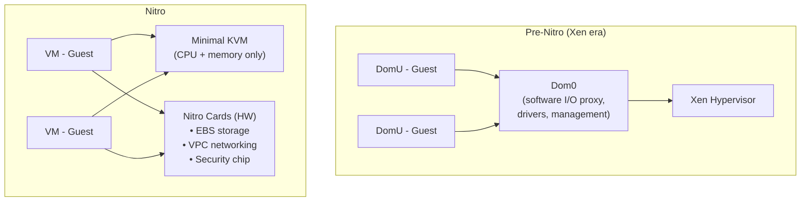

Every developer who's worked with AWS has launched an EC2 instance. You pick an instance type, choose an AMI, SSH in, and deploy your app. Somewhere in the back of your mind, you know there's virtualization happening. But that's where most people stop thinking about it.

Here's what might surprise you: when AWS launched EC2 in August 2006, every instance ran on [Xen](https://en.wikipedia.org/wiki/Xen)  -  an open-source Type 1 bare-metal hypervisor originally created by [Ian Pratt](https://en.wikipedia.org/wiki/Ian_Pratt_(computer_scientist)) and Keir Fraser at the [University of Cambridge](https://en.wikipedia.org/wiki/University_of_Cambridge) in 2003. Then, starting around 2017 with the C5 instance family, AWS began migrating to [Nitro](https://en.wikipedia.org/wiki/Nitro_(microprocessor)): a custom platform built on [KVM](https://en.wikipedia.org/wiki/Kernel-based_Virtual_Machine), which is a Type 2 hosted hypervisor. In the textbook hierarchy, Type 1 sits closer to hardware and is considered superior. So why would AWS move down a tier?

The answer is that the Type 1 vs Type 2 distinction is misleading. What actually matters is where I/O is handled. And Nitro solved that problem in dedicated hardware, making the hypervisor classification almost irrelevant.

<!-- truncate -->

## Glossary

Before we dive in, here are the key terms you'll encounter throughout this post:

| Term | Definition |
|------|-----------|
| **Hypervisor** | Software (or firmware) that creates and manages virtual machines. It sits between the physical hardware and the guest operating systems, dividing resources among them. |
| **Type 1 (bare-metal) hypervisor** | A hypervisor that runs directly on physical hardware with no host operating system underneath. Examples: Xen, VMware ESXi. |
| **Type 2 (hosted) hypervisor** | A hypervisor that runs as software inside a conventional operating system. Examples: KVM (inside Linux), VirtualBox (inside Windows/macOS). |
| **Virtual Machine (VM)** | A software emulation of a complete computer. It has its own CPU, memory, disk, and network  -  all virtual  -  and runs its own operating system. |
| **Guest OS** | The operating system running inside a virtual machine. It believes it's running on real hardware (unless paravirtualized). |
| **Host OS** | The operating system running on the physical machine that hosts the hypervisor and virtual machines. |
| **Paravirtualization** | A technique where the guest OS knows it's virtualized and uses special lightweight drivers to communicate with the hypervisor, instead of the hypervisor emulating real hardware. Faster, but requires guest modification. |
| **Full virtualization** | The guest OS runs unmodified, believing it's on real hardware. The hypervisor intercepts and translates privileged instructions. Slower than paravirtualization, but compatible with any OS. |
| **KVM (Kernel-based Virtual Machine)** | A Linux kernel module that turns Linux into a hypervisor. Handles CPU and memory virtualization using hardware extensions. |
| **QEMU (Quick Emulator)** | A userspace program that emulates I/O devices (disks, NICs, USB, etc.) for virtual machines. Often paired with KVM  -  KVM handles CPU/memory, QEMU handles everything else. |
| **Dom0 (Domain 0)** | In Xen, the first and most privileged virtual machine that boots. It runs Linux, has direct hardware access, and manages all other VMs. |
| **DomU (Domain U)** | In Xen, an unprivileged guest virtual machine. The "U" stands for unprivileged. It has no direct hardware access and relies on Dom0 for I/O. |
| **VMkernel** | ESXi's custom operating system kernel. Not Linux  -  VMware built it from scratch to handle scheduling, networking, storage, and device drivers within the hypervisor itself. |
| **Hypercall** | A system call from a guest OS to the hypervisor, analogous to a syscall from a userspace program to the kernel. Used in paravirtualization. |
| **VT-x / AMD-V** | Hardware virtualization extensions built into Intel and AMD processors. They allow the CPU to natively run guest code without software emulation of privileged instructions. |
| **EPT / NPT** | Extended Page Tables (Intel) / Nested Page Tables (AMD). Hardware extensions for memory virtualization that let the CPU translate guest virtual addresses to physical addresses without hypervisor intervention on every memory access. |
| **NVMe** | Non-Volatile Memory Express. A protocol for accessing storage devices over PCIe. In the Nitro context, EBS volumes appear as NVMe devices to the guest. |
| **ENA** | Elastic Network Adapter. AWS's custom network driver for Nitro instances, replacing Xen's paravirtual network frontend. |
| **PCIe** | Peripheral Component Interconnect Express. The standard high-speed bus for connecting hardware devices (GPUs, NICs, storage controllers) to a CPU. |
| **SR-IOV** | Single Root I/O Virtualization. A hardware standard that allows a single physical PCIe device to present itself as multiple virtual devices, each assignable directly to a VM  -  bypassing the hypervisor for I/O. |

---

## The Setup

Xen was the natural choice for early EC2: it was open source ([GPLv2](https://en.wikipedia.org/wiki/GNU_General_Public_License#Version_2)), battle-tested, and designed from the ground up to run multiple operating systems on a single physical machine. Amazon could take it, modify it, and build a cloud on top without licensing fees or vendor lock-in.

KVM itself was created by [Avi Kivity](https://en.wikipedia.org/wiki/Avi_Kivity) at [Qumranet](https://en.wikipedia.org/wiki/Qumranet) in 2006 and merged into the [Linux kernel](https://en.wikipedia.org/wiki/Linux_kernel) (version 2.6.20) in February 2007. AWS acquired [Annapurna Labs](https://en.wikipedia.org/wiki/Annapurna_Labs), an Israeli chip design company, in January 2015 for approximately $350 million  -  and Annapurna became the team that built the Nitro hardware cards.

---

## Pillar 1: What Each Virtualization Layer Actually Does

If you want a visual primer on how virtualization works before we go deeper, this is a solid overview:

<iframe width="100%" height="450" src="https://www.youtube.com/embed/LabltEXk0VQ" title="YouTube video player" frameBorder="0" allow="accelerometer; autoplay; clipboard-write; encrypted-media; gyroscope; picture-in-picture; web-share" allowFullScreen></iframe>

To understand why the hypervisor type matters less than you think, you first need to understand what each piece of the virtualization stack is responsible for.

KVM virtualizes CPU execution and memory management. It's a Linux kernel module that leverages hardware extensions  -  [Intel VT-x](https://en.wikipedia.org/wiki/X86_virtualization#Intel_virtualization_(VT-x)) (introduced in November 2005 with the [Pentium 4](https://en.wikipedia.org/wiki/Pentium_4) 662/672) and [AMD-V](https://en.wikipedia.org/wiki/X86_virtualization#AMD_virtualization_(AMD-V)) (introduced in May 2006 with the [Athlon 64](https://en.wikipedia.org/wiki/Athlon_64))  -  to run guest code directly on the physical CPU. Before these extensions, hypervisors had to use complex [binary translation](https://en.wikipedia.org/wiki/Binary_translation) techniques to trap and emulate privileged instructions. With VT-x/AMD-V, the CPU itself understands the concept of a guest and a host, switching between them in hardware. For compute-bound work, the overhead is near zero.

Memory virtualization followed a similar path. Early hypervisors maintained "[shadow page tables](https://en.wikipedia.org/wiki/Shadow_page_table)"  -  a software layer that translated guest virtual addresses to host physical addresses, intercepting every page table update. This was expensive. [Intel EPT](https://en.wikipedia.org/wiki/Second_Level_Address_Translation#EPT) (introduced in 2008 with the [Nehalem architecture](https://en.wikipedia.org/wiki/Nehalem_(microarchitecture))) and AMD NPT (introduced in 2007 with [Barcelona](https://en.wikipedia.org/wiki/AMD_10h)) moved this translation into hardware, letting the CPU walk [nested page tables](https://en.wikipedia.org/wiki/Second_Level_Address_Translation) without hypervisor intervention.

[QEMU](https://en.wikipedia.org/wiki/QEMU) (Quick Emulator), originally written by [Fabrice Bellard](https://en.wikipedia.org/wiki/Fabrice_Bellard) in 2003, emulates I/O devices  -  virtual disk controllers, network cards, USB devices, graphics adapters, and so on. It presents what looks like real hardware to the guest. Each VM is a QEMU process running in userspace on the host. Before KVM existed, QEMU could do full system emulation entirely in software  -  including CPU emulation  -  but it was slow. The KVM+QEMU pairing splits the work: KVM handles the fast path (CPU and memory in kernel space), QEMU handles the complex path (device emulation in userspace).

But here's the part people miss: you still need a host OS. KVM is a kernel module  -  it's not a standalone program. It depends on Linux's [CFS (Completely Fair Scheduler)](https://en.wikipedia.org/wiki/Completely_Fair_Scheduler) to schedule VCPUs (each VCPU is just a Linux thread). It depends on Linux's memory manager for page tables, [NUMA](https://en.wikipedia.org/wiki/Non-uniform_memory_access) awareness, [hugepages](https://en.wikipedia.org/wiki/Huge_page), and [KSM (Kernel Same-page Merging)](https://en.wikipedia.org/wiki/Kernel_same-page_merging) (which deduplicates identical memory pages across VMs). QEMU is a regular process that makes syscalls for file I/O, networking, and signal handling. Without Linux underneath, neither can function. If you run `ps aux` on a KVM host, you'll see one QEMU process per VM, just like any other program.

And you still need a guest OS. KVM and QEMU together build you a virtual computer  -  CPU, memory, disk, NIC, all virtualized. But a computer with no operating system is just hardware sitting idle. Something still has to:

- Boot up and initialize the virtual hardware
- Load drivers for the virtual devices QEMU presents
- Implement a filesystem ([ext4](https://en.wikipedia.org/wiki/Ext4), [XFS](https://en.wikipedia.org/wiki/XFS), [NTFS](https://en.wikipedia.org/wiki/NTFS)) on the virtual disk
- Provide a [TCP/IP](https://en.wikipedia.org/wiki/Internet_protocol_suite) networking stack
- Offer a kernel that applications can make syscalls against
- Manage processes, users, permissions, and libraries

Virtual hardware still needs software to run on it. (This is also why containers became popular  -  for many workloads, you can skip the guest OS entirely by sharing the host kernel. [Docker](https://en.wikipedia.org/wiki/Docker_(software)), released in March 2013, and [Firecracker](https://en.wikipedia.org/wiki/Firecracker_(software)), open-sourced in November 2018, both exploit this insight.)

---

## Pillar 2: Type 1 vs Type 2  -  And Why the Line Is Blurry

The textbook distinction, formalized by [Gerald J. Popek](https://en.wikipedia.org/wiki/Gerald_J._Popek) and [Robert P. Goldberg](https://en.wikipedia.org/wiki/Robert_P._Goldberg) in their 1974 paper "[Formal Requirements for Virtualizable Third Generation Architectures](https://en.wikipedia.org/wiki/Popek_and_Goldberg_virtualization_requirements)," is clean:

- **Type 1 (bare-metal):** The hypervisor runs directly on hardware. No host OS. It manages hardware resources and guest VMs itself.
- **Type 2 (hosted):** The hypervisor runs as software inside a conventional operating system. It depends on the host OS for hardware access.

Type 1 hypervisors introduced an important concept: [paravirtualization](https://en.wikipedia.org/wiki/Paravirtualization). The term was coined by the Xen team in their 2003 [SOSP](https://en.wikipedia.org/wiki/Symposium_on_Operating_Systems_Principles) paper "Xen and the Art of Virtualization." Instead of tricking the guest into thinking it's on real hardware (full virtualization), the guest knows it's virtualized and cooperates with the hypervisor. Xen's guests used lightweight "frontend" drivers  -  blkfront for block devices, netfront for networking  -  that communicated with "backend" drivers in Dom0 through shared memory ring buffers and event channels. No hardware emulation, no trap-and-emulate overhead. This was critical in 2003 because hardware virtualization extensions (VT-x/AMD-V) didn't exist yet  -  paravirtualization was the only way to get acceptable performance.

Type 2 guests, by contrast, are typically unaware they're virtualized. QEMU emulates a complete hardware environment  -  an Intel [e1000](https://en.wikipedia.org/wiki/Intel_PRO/1000) NIC, an [IDE](https://en.wikipedia.org/wiki/Parallel_ATA) or [SCSI](https://en.wikipedia.org/wiki/SCSI) disk controller  -  and the guest runs its standard drivers against what it believes is real hardware.

But here's where it gets interesting. The Linux kernel ships with both Xen guest drivers and KVM host code in the same binary. The `drivers/xen/` directory contains the paravirtual frontend drivers for running as a guest on Xen  -  these were merged upstream between 2007 and 2009 through a sustained effort by the Xen community, particularly Jeremy Fitzhardinge and others at [XenSource](https://en.wikipedia.org/wiki/XenSource) (later acquired by [Citrix](https://en.wikipedia.org/wiki/Citrix_Systems) in 2007 for $500 million). The `virt/kvm/` directory contains the code that makes Linux a hypervisor, merged in February 2007. They coexist peacefully.

At boot, the kernel detects what's underneath:

```bash
# On a Xen instance:
dmesg | grep -i hypervisor
> Hypervisor detected: Xen

# On a KVM/Nitro instance:
dmesg | grep -i hypervisor
> Hypervisor detected: KVM
```

The same kernel image works on bare metal, on Xen, or on KVM without modification. It simply activates the right code path based on what it finds.

And KVM itself blurs the Type 1/Type 2 line. Yes, it runs inside Linux. But it operates in kernel space ([ring 0](https://en.wikipedia.org/wiki/Protection_ring)) with direct access to hardware virtualization extensions. It doesn't emulate a CPU  -  it runs guest code natively using VT-x/AMD-V. The guest enters a special CPU mode (VMX non-root on Intel), executes at near-native speed, and only exits back to the hypervisor ("VM exit") when it does something that requires intervention. Performance benchmarks consistently put KVM alongside Type 1 hypervisors. Some people call it "Type 1.5," which tells you the classification system from 1974 doesn't map cleanly onto modern architectures.

---

## Pillar 3: I/O Is the Real Differentiator

If CPU and memory virtualization are essentially solved by hardware extensions, then the real question becomes: who handles I/O, and how?

Each major hypervisor answered this differently, and the differences reveal where performance is actually won or lost.

**Xen** used Dom0 as an I/O proxy. When Xen boots on a physical machine, the first thing it launches is Dom0  -  a privileged Linux VM with direct access to all physical hardware. Dom0 runs real Linux device drivers: the actual Intel NIC driver, the actual SATA controller driver, everything. Every unprivileged guest (DomU) that wants to read a disk block or send a network packet goes through Dom0:

1. The guest's frontend driver (blkfront) places a request into a shared memory ring buffer
2. An event channel notifies Dom0
3. Dom0's backend driver (blkback) picks up the request
4. Dom0 talks to the real hardware using standard Linux drivers
5. The result travels back through the shared memory ring

This was elegant  -  Xen itself stayed tiny (around 150,000 lines of code in early versions), and it reused Linux's entire driver ecosystem through Dom0. But Dom0 was a bottleneck. It consumed CPU and memory on every physical host just to proxy I/O. Under heavy I/O load, Dom0 could become saturated. And it was a single point of failure  -  if Dom0 crashed, every VM on that host lost I/O.

**[ESXi](https://en.wikipedia.org/wiki/VMware_ESXi)** took the monolithic approach. [VMware](https://en.wikipedia.org/wiki/VMware), founded in 1998 by [Diane Greene](https://en.wikipedia.org/wiki/Diane_Greene), [Mendel Rosenblum](https://en.wikipedia.org/wiki/Mendel_Rosenblum), and others at Stanford, released ESX Server in 2001 and the thin ESXi variant in 2007. VMware built their own mini operating system from scratch  -  the VMkernel  -  with its own scheduler, its own TCP/IP stack, its own filesystem ([VMFS](https://en.wikipedia.org/wiki/VMware_VMFS), a clustered filesystem designed for VM disk images), and its own device drivers. No Dom0, no Linux, no middleman. The hypervisor is the I/O layer. ESXi installs from a ~150MB ISO.

The upside: fewer layers, lower latency, no I/O proxy bottleneck. The downside: VMware has to write and maintain drivers for every piece of hardware they support, which is why they publish a strict Hardware Compatibility List (HCL). You can't just plug in any NIC and expect it to work  -  it needs a VMware driver.

**KVM/QEMU** delegates I/O to userspace. Each VM's QEMU process emulates virtual devices and translates I/O operations into host Linux syscalls. Guest writes to virtual disk → QEMU catches it → QEMU calls `pwrite()` on the host → Linux kernel handles the actual disk I/O. It's flexible and benefits from Linux's entire driver ecosystem, but there's overhead in the userspace-to-kernel context switches. Technologies like [virtio](https://en.wikipedia.org/wiki/Virtio) (a standardized paravirtual I/O framework, proposed by [Rusty Russell](https://en.wikipedia.org/wiki/Rusty_Russell) in 2007 and merged into Linux 2.6.25) reduced this overhead significantly by giving guests lightweight drivers that cooperate with QEMU, similar in spirit to Xen's frontend/backend model.

Notice the pattern: in every case, the performance bottleneck isn't CPU virtualization  -  hardware extensions made that nearly free. It's the I/O path. Dom0 proxying, VMkernel processing, QEMU translating  -  that's where the latency lives.

---

## Pillar 4: How Nitro Made the Hypervisor Type Irrelevant

AWS saw this clearly. The problem was never "Type 1 vs Type 2." The problem was that I/O was handled in software, and software I/O has overhead no matter how you architect it.

The Nitro journey happened in stages:

- **2013:** AWS introduced enhanced networking using [SR-IOV](https://en.wikipedia.org/wiki/Single-root_input/output_virtualization) (Single Root I/O Virtualization) on C3 instances. SR-IOV is a [PCIe](https://en.wikipedia.org/wiki/PCI_Express) hardware standard (ratified in 2007 by the [PCI-SIG](https://en.wikipedia.org/wiki/PCI-SIG)) that allows a single physical NIC to present multiple virtual functions, each assignable directly to a VM. This bypassed Dom0 for networking  -  the guest talked directly to a virtual function on the physical NIC. It was the first crack in Dom0's monopoly on I/O.
- **January 2015:** AWS acquired Annapurna Labs for ~$350 million. Annapurna, founded in 2011 in Yokneam, Israel, by [Avigdor Willenz](https://en.wikipedia.org/wiki/Avigdor_Willenz) (who had previously founded [Galileo Technology](https://en.wikipedia.org/wiki/Galileo_Technology) and [Marvell](https://en.wikipedia.org/wiki/Marvell_Technology)), specialized in custom [ARM-based](https://en.wikipedia.org/wiki/ARM_architecture_family) [SoCs](https://en.wikipedia.org/wiki/System_on_a_chip). This acquisition gave AWS the silicon design capability to build custom I/O hardware.
- **2016:** The Nitro card for EBS appeared, offloading storage I/O from the host CPU to a dedicated hardware card. No more Dom0 or QEMU in the storage path.
- **2017:** AWS launched the C5 instance family  -  the first instance type running on the full Nitro platform. The hypervisor was KVM-based. Networking was handled by the Nitro card for VPC (with [ENA](https://en.wikipedia.org/wiki/Elastic_Network_Adapter) drivers). Storage was handled by the Nitro card for EBS (with [NVMe](https://en.wikipedia.org/wiki/NVM_Express) drivers). Security and management ran on the Nitro security chip. The host CPU ran a minimal KVM hypervisor that handled only CPU and memory isolation.
- **2018:** AWS open-sourced [Firecracker](https://en.wikipedia.org/wiki/Firecracker_(software)), the [microVM](https://en.wikipedia.org/wiki/Microvm) monitor built on KVM that powers Lambda and Fargate. Firecracker boots a VM in ~125 milliseconds with ~5MB of memory overhead  -  demonstrating just how thin the virtualization layer can be when I/O is handled elsewhere.
- **2023:** AWS announced Nitro v5 with further performance improvements and the Nitro [Trusted Platform Module (TPM)](https://en.wikipedia.org/wiki/Trusted_Platform_Module) for enhanced security.

The architecture shift looks like this:



Dom0 is gone. QEMU is not in the I/O path. The hypervisor is so thin it barely exists. And the migration from Xen to KVM was transparent to customers because  -  as we covered in Pillar 2  -  the Linux kernel already carried both Xen guest drivers and KVM support. Existing AMIs worked without modification. The kernel detected KVM instead of Xen at boot and activated the right code path. Customers on newer instance types saw NVMe and ENA devices instead of Xen paravirtual devices, but those drivers were already in the kernel too.

Nobody had to rebuild their AMI. Nobody had to change their deployment scripts. The entire hypervisor substrate changed underneath millions of running workloads, and the abstraction held.

---

## The Takeaway

The Type 1 vs Type 2 classification made sense in 1974 when Popek and Goldberg formalized it, and it still made sense in 2003 when the choice between Xen and VMware Workstation was a meaningful architectural decision. But hardware virtualization extensions leveled the playing field for CPU and memory. What remained was the I/O problem  -  and that turned out to be a hardware design problem, not a software classification problem.

AWS didn't move "down" from Type 1 to Type 2. They moved the thing that actually mattered  -  I/O  -  into dedicated silicon, and made the hypervisor layer so thin that its classification became academic. The question isn't "Type 1 or Type 2?" The question is "where does I/O happen?" And if the answer is "in purpose-built hardware," the hypervisor type barely matters.

The next time you launch an EC2 instance, you're not just running a VM. You're running on a decade of architectural decisions  -  from a Cambridge research project in 2003, through an Israeli chip startup acquisition in 2015, to custom silicon that made the oldest debate in virtualization irrelevant.
