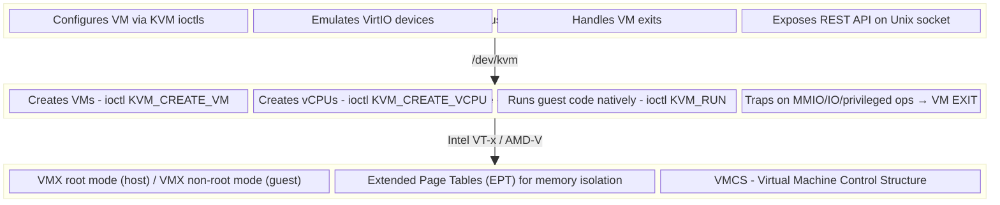
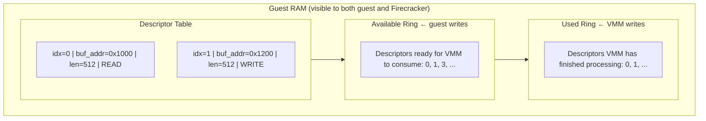
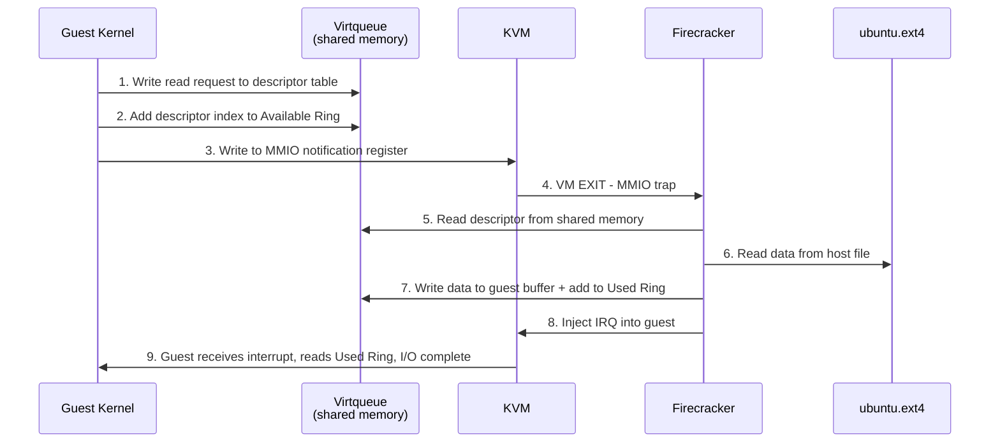
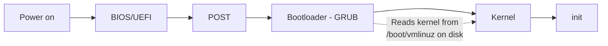
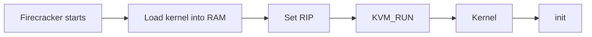
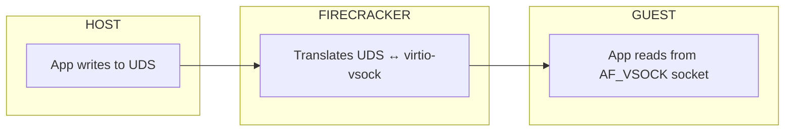

If you've used AWS Lambda or Fargate, your code ran inside Firecracker. Not a container. Not a traditional VM. A *microVM* - a lightweight virtual machine that boots in ~125 milliseconds, uses about 5 MiB of memory overhead, and provides the hard security boundary of hardware virtualization.

Firecracker was open-sourced by AWS in 2018, and the [NSDI '20 paper](https://www.usenix.org/conference/nsdi20/presentation/agache) revealed the engineering decisions behind it. But most engineers interact with it indirectly - through Lambda invocations or Fargate tasks - without understanding what's happening underneath.

This article is a deep dive into Firecracker's internals. We'll walk through the full virtualization stack - from KVM ioctls to VirtIO virtqueues - and build a working microVM from scratch along the way. The goal is to give you a mental model of how modern lightweight virtualization actually works, not just what it is, but *why* each design decision was made.

<!-- truncate -->

## 1. What is Firecracker and Why Does It Exist?

### The Problem: Containers Aren't Secure Enough, VMs Aren't Fast Enough

Before Firecracker, AWS Lambda faced a fundamental tension:

**Containers** (Docker, runc) share the host kernel. They use namespaces and cgroups for isolation, but the attack surface is enormous - every syscall is a potential escape vector. Running untrusted customer code in containers is a security risk. The [CVE-2019-5736](https://nvd.nist.gov/vuln/detail/CVE-2019-5736) runc escape demonstrated this isn't theoretical.

**Traditional VMs** (QEMU/KVM, Xen) provide strong isolation through hardware virtualization - each VM has its own kernel, its own address space, mediated by the CPU's VT-x/AMD-V extensions. But they're heavy. QEMU emulates a full PC: BIOS, PCI bus, ACPI tables, USB controllers, VGA adapters. Booting one takes seconds. Running millions of them is impractical.

AWS needed something that didn't exist: **VM-level security with container-level speed and density.**

### The Solution: A Purpose-Built VMM

Firecracker is a **Virtual Machine Monitor (VMM)** - not a hypervisor. This distinction matters:

- **KVM** (the Linux kernel module) is the hypervisor. It manages hardware virtualization - creating VMs, running guest code on the CPU, trapping on privileged operations.
- **Firecracker** is a userspace process that configures VMs via KVM and emulates the minimal set of devices a Linux guest needs to boot.

Firecracker is written in Rust (~50K lines), started as a fork of Google's [crosvm](https://chromium.googlesource.com/crosvm/crosvm/) (which was built for Chrome OS), and was stripped down to support exactly one use case: booting a Linux guest with a virtio block device, optional virtio network, and a serial console.

No BIOS. No bootloader. No PCI bus (by default). No USB. No GPU. No sound card. No device hotplug. No live migration. Just the absolute minimum to boot Linux and run a workload.

---

## 2. Architecture: KVM, the VMM, and VirtIO/MMIO

### The Three Layers

Understanding Firecracker requires understanding three distinct layers that work together:



### KVM: The Hypervisor

KVM exposes virtualization through `/dev/kvm` - a character device that accepts ioctls. The lifecycle of a VM looks like this:

```c
// 1. Open KVM
int kvm_fd = open("/dev/kvm", O_RDWR);

// 2. Create a VM
int vm_fd = ioctl(kvm_fd, KVM_CREATE_VM, 0);

// 3. Set up guest memory
// mmap a region, then tell KVM about it
struct kvm_userspace_memory_region region = {
 .slot = 0,
 .guest_phys_addr = 0,
 .memory_size = 256 * 1024 * 1024, // 256 MiB
 .userspace_addr = (uint64_t)mmap(...)
};
ioctl(vm_fd, KVM_SET_USER_MEMORY_REGION, &region);

// 4. Create a vCPU
int vcpu_fd = ioctl(vm_fd, KVM_CREATE_VCPU, 0);

// 5. Set CPU registers (RIP = kernel entry point)
struct kvm_regs regs;
regs.rip = kernel_entry_address;
ioctl(vcpu_fd, KVM_SET_REGS, &regs);

// 6. Run the guest
while (1) {
 ioctl(vcpu_fd, KVM_RUN, 0);
 // Handle VM exit...
}
```

When `KVM_RUN` is called, the CPU switches to VMX non-root mode and executes guest code *natively* - at full hardware speed. No emulation, no translation. The guest runs real x86 instructions on the real CPU.

The CPU only traps back to the host (a **VM EXIT**) when the guest does something that needs VMM intervention: accessing an MMIO address, executing a privileged I/O instruction, or hitting a page fault that KVM can't resolve.

### VirtIO: Paravirtualized I/O

Instead of emulating real hardware (like an Intel e1000 NIC or a SATA controller), Firecracker uses **VirtIO** - a standardized interface where the guest *knows* it's virtualized and cooperates with the VMM for I/O.

VirtIO was created by Rusty Russell at IBM in 2007, originally for QEMU/KVM. The key abstraction is the **virtqueue** - a ring buffer in shared memory:



The flow for a disk read:



No data copying between address spaces. No serialization. The VMM reads and writes directly in guest RAM.

### MMIO vs PCI Transport

VirtIO devices need a way to be *discovered* by the guest and a way to exchange notifications. There are two transports:

**MMIO (Memory-Mapped I/O)** - Firecracker's default:
- Each device gets a 4KB memory region (e.g., `0xd0000000`)
- Guest writes to these addresses → KVM traps → VM EXIT → Firecracker handles it
- Devices are passed to the kernel via boot args: `virtio_mmio.device=4K@0xd0000000:5`
- Simple, no PCI bus needed

**PCI** - Firecracker supports this with `--enable-pci`:
- Devices appear on a virtual PCI bus
- Guest discovers them via standard PCI enumeration
- Higher throughput and lower latency (MSI-X interrupts, better batching)
- Requires a kernel with PCI support

MMIO is simpler and was Firecracker's original transport. PCI was added later for performance. The Firecracker team recommends PCI for production workloads.

---

## 3. The Boot Sequence: Direct Kernel Loading and the Kernel/Rootfs Split

### No BIOS, No Bootloader

A traditional VM boot looks like this:



Firecracker skips everything before the kernel:



There is no BIOS. No UEFI. No GRUB. Firecracker *is* the bootloader. It reads the `vmlinux` binary from the host filesystem, copies it into guest memory at the correct address, sets up the boot parameters (the Linux [boot protocol](https://www.kernel.org/doc/html/latest/x86/boot.html) `struct boot_params`), points the instruction pointer (RIP) at the kernel's entry point, and calls `KVM_RUN`.

This is called **direct kernel loading**, and it's one of the biggest reasons Firecracker boots so fast. A BIOS POST alone can take hundreds of milliseconds. GRUB adds more. Firecracker eliminates all of it.

### The Kernel and Rootfs Are Decoupled

This surprises many engineers: in Firecracker, the kernel and the root filesystem are **two separate files**.

```
vm_config.json:
{
 "boot-source": {
 "kernel_image_path": "/path/to/vmlinux", ← the kernel
 "boot_args": "console=ttyS0 reboot=k panic=1"
 },
 "drives": [{
 "drive_id": "rootfs",
 "path_on_host": "/path/to/ubuntu.ext4", ← the rootfs
 "is_root_device": true
 }]
}
```

This is actually how *all* Linux works - a distro is just a kernel bundled with a curated set of userspace tools. Ubuntu, Amazon Linux, Alpine - they all use the same Linux kernel (different versions/configs), just with different userspace. Firecracker makes this separation explicit.

**The kernel provides:**
- CPU scheduling, memory management (virtual memory, MMU)
- Device drivers (VirtIO, serial, etc.)
- Filesystem support (ext4, proc, sys)
- Network stack (TCP/IP)
- System call interface

**The rootfs provides:**
- `/sbin/init` (PID 1 - systemd, busybox init, or a custom binary)
- Shell (`/bin/bash`, `/bin/sh`)
- Libraries (libc, libpthread)
- Package manager, services, applications
- Everything you actually interact with

If you boot the kernel without a rootfs, you get:

```
Kernel panic - not syncing: VFS: Unable to mount root fs on unknown-block(0,0)
```

The kernel is an engine without a car. It runs, but it can't do anything useful without userspace.

### Why This Matters for Boot Time

The ~125ms Firecracker boot time is the **VMM boot** - from "start Firecracker" to "kernel begins executing." But the total time to "application ready" depends on what's in the rootfs:

```
Firecracker VMM startup: ~125ms (fixed)
Kernel initialization: ~50-100ms (fixed)
Ubuntu 22.04 with systemd: ~1-2 seconds
Alpine with OpenRC: ~200-400ms
Custom minimal init (single binary): ~10-50ms
Lambda-style (no init, just handler): ~few ms
```

AWS Lambda doesn't boot Ubuntu. It uses a minimal rootfs where "init" is essentially: mount filesystem → exec your function handler. That's how they achieve the advertised boot times.

You can swap rootfs images freely. The same kernel boots Ubuntu, Amazon Linux, Alpine, or a custom 5MB image with just busybox. You can even build an Amazon Linux rootfs from a Docker image:

```bash
docker create --name al2023 amazonlinux:2023
docker export al2023 -o al2023.tar
mkdir al2023-root && tar -xf al2023.tar -C al2023-root
truncate -s 1G al2023.ext4
mkfs.ext4 -d al2023-root -F al2023.ext4
```

Point `vm_config.json` at `al2023.ext4` and you're running Amazon Linux in Firecracker.

### The Boot Args Explained

The kernel command line `console=ttyS0 reboot=k panic=1` is small but each argument is deliberate:

| Argument | Purpose |
|---|---|
| `console=ttyS0` | Send all kernel output to the first serial port. Firecracker maps this to its own stdout - that's how you see boot messages in your terminal. |
| `reboot=k` | Use the keyboard controller reset method for reboot. Firecracker doesn't emulate real power management, so this triggers a clean VMM exit. |
| `panic=1` | On kernel panic, wait 1 second then reboot. Combined with `reboot=k`, this means a panicked VM exits cleanly instead of hanging forever. |

Firecracker also appends `root=/dev/vda rw virtio_mmio.device=4K@0xd0000000:5` automatically, telling the kernel where to find the rootfs (the VirtIO block device) and the MMIO device mapping.

---

## 4. Firecracker vs QEMU: What's Actually Different?

### QEMU Can Do Everything Firecracker Does

This is the uncomfortable truth: QEMU supports every technique Firecracker uses. Direct kernel loading, VirtIO, MMIO transport, KVM acceleration - all of it. QEMU even added a `-M microvm` machine type (inspired by Firecracker) that strips away the BIOS, PCI bus, and legacy devices:

```bash
qemu-system-x86_64 \
 -M microvm \
 -enable-kvm \
 -cpu host \
 -m 256 -smp 2 \
 -kernel ./vmlinux \
 -append "console=ttyS0 reboot=k panic=1" \
 -drive id=rootfs,file=ubuntu.ext4,format=raw,if=none \
 -device virtio-blk-device,drive=rootfs \
 -serial stdio -no-reboot -nographic
```

This boots a VM that looks almost identical to a Firecracker microVM. Same kernel, same rootfs, same VirtIO MMIO devices, same serial console. Boot time is close too - ~150-200ms vs Firecracker's ~125ms.

So why does Firecracker exist?

### The Differences That Matter

| Dimension | QEMU | Firecracker |
|---|---|---|
| **Codebase** | ~2M lines of C | ~50K lines of Rust |
| **Language safety** | Manual memory management | Memory-safe by default |
| **Attack surface** | Huge - even with microvm, the binary contains all code paths | Minimal - only the code that's needed exists |
| **Configuration** | Hundreds of flags, easy to misconfigure | One JSON file, few options |
| **Security jail** | External (seccomp, SELinux, AppArmor) | Built-in jailer binary with chroot + seccomp + cgroups |
| **Device support** | Thousands of emulated devices | 5 devices: virtio-block, virtio-net, virtio-vsock, serial, keyboard |
| **Snapshot/restore** | Yes (complex) | Yes (purpose-built for serverless) |
| **Live migration** | Yes | No |
| **Device hotplug** | Yes | No |

The codebase size is the critical difference. QEMU's 2M lines of C represent 20+ years of accumulated features - IDE controllers, floppy drives, Sound Blaster emulation, SCSI adapters, GPU passthrough. Even when you use `-M microvm`, that code is still compiled into the binary. A vulnerability in *any* QEMU code path - even one you're not using - is a potential escape vector.

Firecracker's 50K lines of Rust mean there's simply less code to audit, less code to exploit, and the code that exists has Rust's memory safety guarantees.

### Was Firecracker a Real Innovation?

The individual pieces weren't new. KVM existed. VirtIO existed. Direct kernel loading existed. Even the idea of a minimal VMM existed (Google's crosvm, Intel's NEMU, the academic Solo5/ukvm project).

What Firecracker brought together was:

1. **The constraint as a feature** - deliberately leaving out 95% of what a VMM traditionally does. QEMU kept adding features for 20 years. Firecracker's innovation was saying "no" to almost everything. That's an architecture decision, not just engineering.

2. **Rust for a production VMM** - in 2017-2018, writing a security-critical VMM in Rust was a bold bet. This influenced the entire industry: crosvm, Cloud Hypervisor, and others followed.

3. **The jailer** - a purpose-built security sandbox that runs each VMM process in its own chroot with a minimal seccomp filter (allowing only ~25 syscalls). Defense in depth, built into the project rather than bolted on.

4. **Scale-first design** - optimized for "millions of short-lived VMs" rather than "a few long-running VMs." Different constraints produce different solutions.

The analogy: Apple didn't invent touchscreens, cellular radios, or mobile apps. But the iPhone was still an innovation - it was the right combination of existing technologies, designed for a specific use case, executed at production quality. Firecracker is similar.

### Prior Art

| Project | Relationship to Firecracker |
|---|---|
| **crosvm** (Google) | Firecracker started as a fork of crosvm. Minimal Rust VMM for Chrome OS. |
| **NEMU** (Intel) | Stripped-down QEMU. Still carried QEMU's legacy codebase. |
| **Kata Containers** | Lightweight VMs for containers, but used QEMU underneath. |
| **gVisor** (Google) | Userspace kernel - intercepts syscalls, not a real VM. Different security model. |
| **Solo5/ukvm** | Academic minimal unikernel monitor. Not production-ready at scale. |

Firecracker's contribution was proving that a minimal, Rust-based VMM could work at AWS scale - and then open-sourcing it so the industry could build on it.

---

## 5. Host-Guest Communication: Networking, vsock, and the Serial Console

A Firecracker microVM is isolated by design. But workloads need to communicate - receive tasks, return results, access the network. Firecracker provides three communication channels, each with different trade-offs.

### TAP Networking (virtio-net)

The traditional approach: create a TAP device on the host, attach it to the VM as a VirtIO network interface, and use TCP/IP.

```bash
# Host: create TAP device
ip tuntap add dev tap0 mode tap
ip addr add 172.16.0.1/30 dev tap0
ip link set dev tap0 up

# Enable forwarding for internet access
echo 1 > /proc/sys/net/ipv4/ip_forward
iptables -t nat -A POSTROUTING -o eth0 -j MASQUERADE
```

```json
// vm_config.json
"network-interfaces": [{
 "iface_id": "net1",
 "guest_mac": "06:00:AC:10:00:02",
 "host_dev_name": "tap0"
}]
```

The guest gets a `virtio-net` device. The MAC address `06:00:AC:10:00:02` maps to guest IP `172.16.0.2` (the Firecracker CI rootfs includes a script that derives the IP from the MAC). Once networking is up, you can SSH in (`root`/`root` on the CI rootfs) or make outbound connections.

Under the hood, this uses the same virtqueue mechanism as the block device - the guest puts network packets in shared memory, notifies the VMM via MMIO, and Firecracker forwards them through the TAP device.

### vsock: The Serverless Communication Channel

vsock (VM Sockets) is a direct host↔guest communication channel that bypasses the entire network stack. No IP addresses, no TCP, no TAP devices. It's a Linux kernel socket family (`AF_VSOCK`) that was originally created by VMware and later extended to support VirtIO.



Each VM gets a **CID** (Context ID): host is CID 2, guests are CID 3+. Communication uses port numbers, like TCP.

**Guest side (listener):**
```python
import socket
s = socket.socket(socket.AF_VSOCK, socket.SOCK_STREAM)
s.bind((socket.VMADDR_CID_ANY, 5000))
s.listen()
conn, addr = s.accept()
data = conn.recv(1024) # "hello from host"
```

**Host side (connector):**
```python
import socket
s = socket.socket(socket.AF_VSOCK, socket.SOCK_STREAM)
s.connect((3, 5000)) # CID 3 = guest, port 5000
s.send(b"hello from host")
```

Firecracker configuration:
```json
"vsock": {
 "guest_cid": 3,
 "uds_path": "/tmp/firecracker-vsock.sock"
}
```

Firecracker maps the vsock to a Unix domain socket on the host. The data path is: host app → Unix socket → Firecracker → virtio-vsock (shared memory virtqueues) → guest app. No network stack involved on either side.

**Why vsock matters for serverless:** This is how Lambda-like systems communicate with guest workloads. Send the function payload over vsock, receive the response back. It's faster than TCP (no protocol overhead, no packet framing), more secure (no network attack surface), and simpler to configure (no IP addresses or routing).

vsock is a Linux kernel feature (`AF_VSOCK`, added in Linux 3.9), not Firecracker-specific. The transport layer varies by hypervisor:

| Hypervisor | vsock Transport |
|---|---|
| KVM/Firecracker | `vhost_vsock` (VirtIO) |
| VMware | `vmci_transport` |
| Hyper-V | `hyperv_transport` |

The application code is identical regardless of transport - only the kernel driver differs.

### Serial Console

The simplest channel: Firecracker emulates a 16550 UART at I/O port `0x3F8`. When the guest writes to this port (via `console=ttyS0`), KVM traps the I/O access, and Firecracker writes the byte to its own stdout. Input works in reverse - Firecracker reads from stdin and injects it into the guest's serial port.

This is how you get an interactive shell when running Firecracker in the foreground. It's not fast enough for data transfer, but it's perfect for debugging and interactive use.

### Choosing the Right Channel

| Channel | Use Case | Throughput | Setup Complexity |
|---|---|---|---|
| **TAP + virtio-net** | Internet access, SSH, general networking | High | Medium (TAP, IP, iptables) |
| **vsock** | Host↔guest RPC, function invocation, control plane | High | Low (one config field) |
| **Serial console** | Debugging, interactive shell, boot logs | Low (~115200 baud) | None (always available) |

For serverless workloads, vsock is the clear winner. For general-purpose VMs that need internet access, TAP networking. For debugging, the serial console is always there.

---

## 6. The Orchestration Ecosystem and Running Firecracker in Practice

Firecracker is a VMM, not a platform. It boots a VM and emulates devices - that's it. Everything else - downloading images, building rootfs images, managing VM lifecycles, setting up networking, routing work to VMs - requires orchestration. Several open-source projects fill this gap.

### OSS Orchestration Projects

| Project | What It Does | Maintained By |
|---|---|---|
| **[Kata Containers](https://github.com/kata-containers/kata-containers)** | OCI-compatible runtime that uses Firecracker (or QEMU) as a backend. Integrates with Kubernetes via CRI. The most mature option. | OpenInfra Foundation |
| **[firecracker-containerd](https://github.com/firecracker-microvm/firecracker-containerd)** | Runs containers inside Firecracker VMs using containerd. Each container gets its own microVM. | AWS (mostly inactive now) |
| **[Flintlock](https://github.com/weaveworks-liquidmetal/flintlock)** | MicroVM lifecycle management - create, start, stop, delete via gRPC API. Handles rootfs, kernel, networking. | Weaveworks |
| **[Ignite](https://github.com/weaveworks/ignite)** | "Docker for VMs" - pull OCI images, boot them as Firecracker microVMs. `ignite run amazonlinux:2023`. | Weaveworks |
| **[VHive](https://github.com/vhive-serverless/vHive)** | Academic serverless platform built on Firecracker. Closest to Lambda's architecture. | MIT |

For Kubernetes integration, **Kata Containers + Firecracker backend** is the recommended path. For Lambda-like serverless research, **VHive** is the closest open-source equivalent.

### What None of Them Replicate

AWS Lambda's orchestration layer is far more than just "start a Firecracker VM":

- **MicroManager** - placement and scheduling of millions of microVMs across a fleet
- **Snapshot/restore** - pre-warmed VMs from memory snapshots for near-instant cold starts (Firecracker supports the snapshot API; orchestrating it at scale is the hard part)
- **Worker Manager** - fleet-level health, capacity, and bin-packing
- **Slot management** - reusing warm VMs across invocations of the same function

The open-source ecosystem gives you the building blocks. The production orchestration at Lambda scale is where the real complexity lives.

### Hands-On: Booting a Firecracker microVM from Scratch

Here's the complete procedure to go from a bare EC2 instance to a running Firecracker microVM. This was tested on a `c8i.xlarge` (nested virtualization enabled) running Amazon Linux 2023.

**Prerequisites:** An EC2 instance with `/dev/kvm` available. Either a `.metal` instance type, or a newer instance type with nested virtualization enabled (c8i, m7i, etc.).

**Step 1: Verify KVM and install tools**

```bash
ls -la /dev/kvm # Must exist
uname -m # Must be x86_64 or aarch64
yum install -y squashfs-tools e2fsprogs
```

**Step 2: Download Firecracker**

```bash
ARCH=x86_64
VERSION=v1.10.1
curl -fsSL \
 https://github.com/firecracker-microvm/firecracker/releases/download/${VERSION}/firecracker-${VERSION}-${ARCH}.tgz \
 | tar -xz
mv release-${VERSION}-${ARCH}/firecracker-${VERSION}-${ARCH} /usr/local/bin/firecracker
chmod +x /usr/local/bin/firecracker
rm -rf release-${VERSION}-${ARCH}
firecracker --version
```

**Step 3: Download kernel and rootfs from Firecracker CI**

```bash
mkdir -p /root/firecracker-demo && cd /root/firecracker-demo
ARCH=x86_64 && CI_VERSION=v1.10

# Kernel (use 5.10.x for nested virt compatibility)
latest_kernel=$(curl -s \
 "http://spec.ccfc.min.s3.amazonaws.com/?prefix=firecracker-ci/$CI_VERSION/$ARCH/vmlinux-&list-type=2" \
 | grep -oP "(?<=<Key>)(firecracker-ci/$CI_VERSION/$ARCH/vmlinux-5\.10\.[0-9]+)(?=</Key>)" \
 | sort -V | tail -1)
wget -q "https://s3.amazonaws.com/spec.ccfc.min/${latest_kernel}" -O vmlinux

# Rootfs
latest_rootfs=$(curl -s \
 "http://spec.ccfc.min.s3.amazonaws.com/?prefix=firecracker-ci/$CI_VERSION/$ARCH/ubuntu-&list-type=2" \
 | grep -oP "(?<=<Key>)(firecracker-ci/$CI_VERSION/$ARCH/ubuntu-[0-9]+\.[0-9]+\.squashfs)(?=</Key>)" \
 | sort -V | tail -1)
wget -q "https://s3.amazonaws.com/spec.ccfc.min/${latest_rootfs}" -O ubuntu.squashfs
```

**Step 4: Convert rootfs to ext4**

```bash
unsquashfs ubuntu.squashfs
truncate -s 1G ubuntu.ext4
mkfs.ext4 -d squashfs-root -F ubuntu.ext4
rm -rf squashfs-root ubuntu.squashfs
```

**Step 5: Create VM config and boot**

```bash
touch firecracker.log

cat > vm_config.json << 'EOF'
{
 "boot-source": {
 "kernel_image_path": "/root/firecracker-demo/vmlinux",
 "boot_args": "console=ttyS0 reboot=k panic=1"
 },
 "drives": [{
 "drive_id": "rootfs",
 "path_on_host": "/root/firecracker-demo/ubuntu.ext4",
 "is_root_device": true,
 "is_read_only": false
 }],
 "machine-config": { "vcpu_count": 2, "mem_size_mib": 256 },
 "logger": {
 "log_path": "/root/firecracker-demo/firecracker.log",
 "level": "Info", "show_level": true, "show_log_origin": true
 }
}
EOF

rm -f /tmp/firecracker.socket
firecracker --api-sock /tmp/firecracker.socket --config-file vm_config.json
```

You'll see the kernel boot, then a login prompt. Login with `root` / `root`. You're inside a Firecracker microVM.

Type `reboot` to exit cleanly.

### A Note on Nested Virtualization

If you're running on a non-metal instance (like `c8i.xlarge`), use the **5.10.x kernel**. The 6.1.x kernel has an FPU/XSTATE initialization bug that causes a kernel panic under nested KVM:

```
general protection fault ... fpu__init_cpu_xstate+0x69/0xb0
Kernel panic - not syncing: Attempted to kill the idle task!
```

On `.metal` instances (e.g., `c5.metal`, `m5.metal`), any kernel version works because KVM runs directly on hardware without a nested virtualization layer.

---

## Conclusion

Firecracker is a study in purposeful minimalism. It doesn't do anything that KVM and VirtIO couldn't already do - it just refuses to do anything else. No BIOS, no bootloader, no PCI bus (by default), no legacy device emulation, no live migration, no device hotplug. Just the minimum viable VMM to boot a Linux guest and run a workload.

The result is a ~50K line Rust codebase that boots VMs in ~125ms with ~5 MiB of overhead, providing hardware-level isolation for millions of concurrent workloads. It powers Lambda and Fargate, and its open-source release has influenced the entire virtualization ecosystem - from QEMU's microvm machine type to the proliferation of Rust-based VMMs.

Understanding Firecracker means understanding the full stack: KVM's ioctl interface, VirtIO's shared-memory virtqueues, MMIO device discovery, direct kernel loading, and the deliberate separation of kernel and rootfs. These aren't Firecracker-specific concepts - they're the building blocks of modern Linux virtualization. Firecracker just makes them visible by stripping away everything that usually hides them.

---

## Further Reading

- [Firecracker NSDI '20 Paper](https://www.usenix.org/conference/nsdi20/presentation/agache) - the academic paper with full design rationale
- [Firecracker Design Doc](https://github.com/firecracker-microvm/firecracker/blob/main/docs/design.md) - official design document
- [VirtIO Specification](https://docs.oasis-open.org/virtio/virtio/v1.2/virtio-v1.2.html) - the OASIS standard
- ["virtio: Towards a De-Facto Standard For Virtual I/O Devices"](https://ozlabs.org/~rusty/virtio-spec/virtio-paper.pdf) - Rusty Russell's original 6-page paper
- [KVM API Documentation](https://docs.kernel.org/virt/kvm/api.html) - the kernel's KVM interface
- [Firecracker Getting Started Guide](https://github.com/firecracker-microvm/firecracker/blob/main/docs/getting-started.md) - official setup instructions
