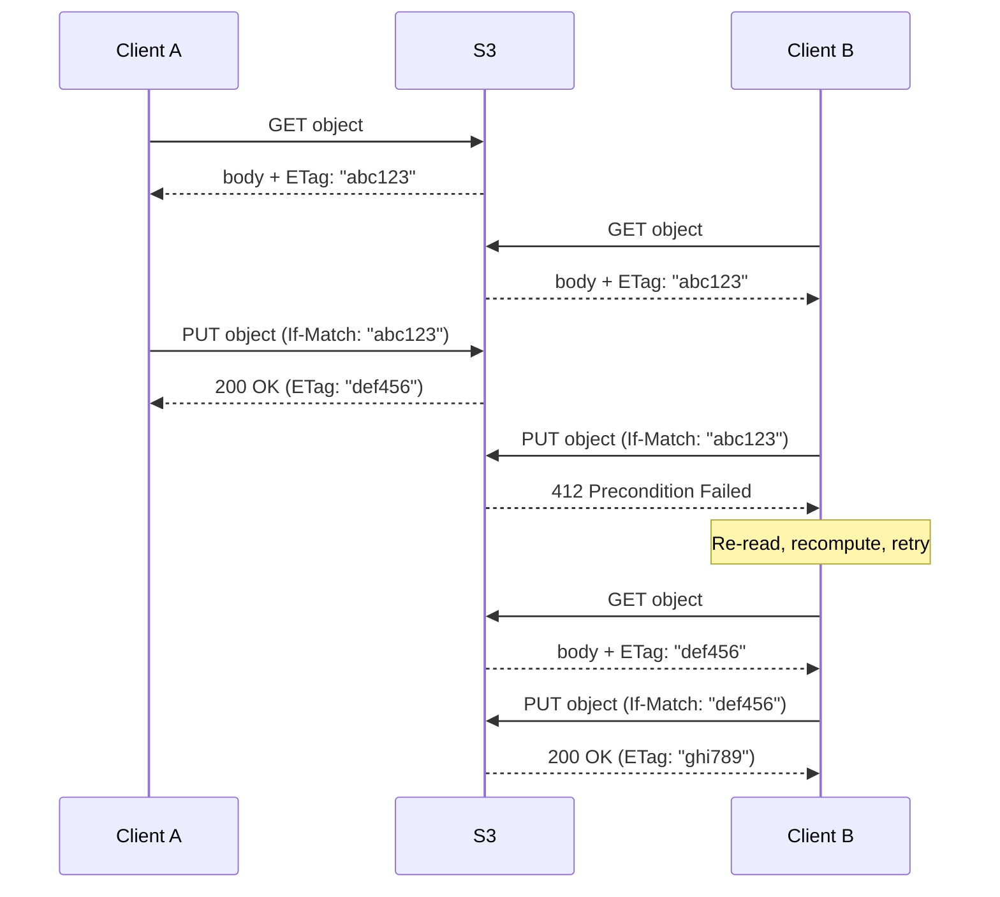
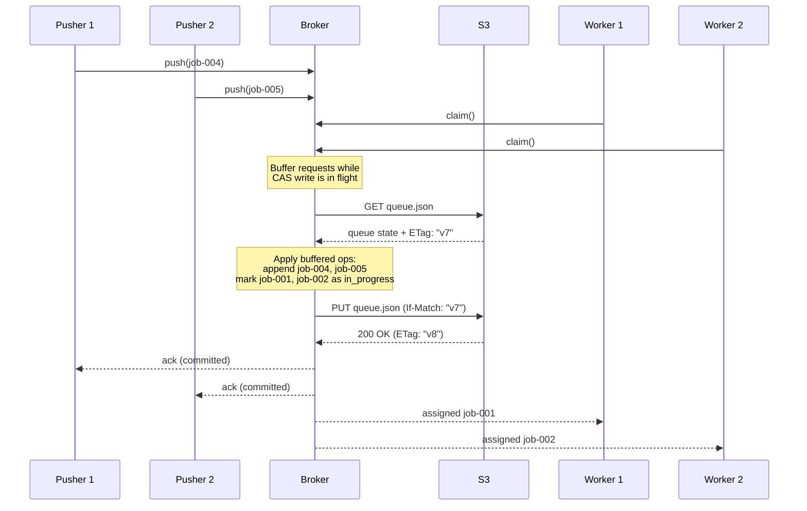

Distributed coordination requires locks, leader election, and consistent configuration. The standard approach: deploy [etcd](https://etcd.io/), [ZooKeeper](https://zookeeper.apache.org/), or provision a [DynamoDB](https://aws.amazon.com/dynamodb/) table with conditional expressions. Teams treat S3 as file storage.

Object stores now support consensus primitives.

[Google Cloud Storage (GCS)](https://cloud.google.com/storage/docs/request-preconditions) has supported conditional writes via generation-match preconditions since its early releases. [Azure Blob Storage](https://docs.microsoft.com/rest/api/storageservices/specifying-conditional-headers-for-blob-service-operations) has supported `If-Match` / `If-None-Match` on ETags for the same duration. S3 was the last to adopt. In May 2024, materializedview.io [identified the gap](https://materializedview.io/p/s3-is-showing-its-age): *"S3 has no compare-and-swap operation, something every single other competitor has."*

S3 closed the gap in two releases. [`If-None-Match` shipped in August 2024](https://aws.amazon.com/about-aws/whats-new/2024/08/amazon-s3-conditional-writes/). [Full `If-Match` Compare-And-Swap (CAS) shipped in November 2024](https://aws.amazon.com/about-aws/whats-new/2024/11/amazon-s3-functionality-conditional-writes/). AWS described the feature as *"reliably offloading compare and swap operations to S3."*

All three major object stores now support [CAS](https://en.wikipedia.org/wiki/Compare-and-swap). Herlihy [proved in 1991](https://cs.brown.edu/~mph/Herlihy91/p124-herlihy.pdf) that CAS is a [universal primitive](https://arunlakshman.info/cas-universal-primitive): the single operation sufficient to build any concurrent data structure, wait-free.

Every major object store provides a universal coordination primitive. Most teams have not recognized this.

<!-- truncate -->

## CAS Is All You Need

In 1991, Maurice Herlihy proved that synchronization primitives form a strict hierarchy based on their *consensus number*: the maximum number of threads for which they solve consensus wait-free.

| Primitive | Consensus Number | Implication |
|---|---|---|
| Read/Write registers | 1 | Mutual exclusion with blocking only |
| Test-and-Set | 2 | Wait-free consensus for 2 participants |
| Compare-And-Swap | ∞ | Wait-free consensus for any number of participants |

CAS implements any concurrent object (queues, stacks, locks, counters, leader election, distributed logs) for any number of participants. Every participant completes in bounded steps. No deadlocks. No blocking. No dependency on other participants being alive.

The proof uses a *universal construction*. Given any sequential object specification and a CAS primitive:

1. Maintain a shared log of operations.
2. Each thread proposes its operation as the next entry.
3. Threads use CAS-based consensus to agree on which operation wins.
4. The winner's operation appends to the log.
5. All threads replay the log to compute the result.

This construction proves CAS is sufficient to implement any concurrent data structure: queues, stacks, hash tables, priority queues, or data structures not yet designed. If a sequential specification exists, CAS makes it concurrent and wait-free.

This universality is why every modern processor architecture converged on CAS as a hardware instruction: x86 provides `CMPXCHG`, ARM provides `LDREX/STREX`, RISC-V provides `LR/SC`. CAS is not a convenience. It is a computational necessity. Without it, entire classes of wait-free algorithms cannot exist.

### CAS on Object Storage

S3's `If-Match` conditional write implements CAS over a globally durable, strongly consistent namespace:

1. **Read** the object and its ETag.
2. **Compute** the new state locally.
3. **Write** with `If-Match: <old-etag>`.
4. If the ETag changed, S3 returns `412 Precondition Failed`. Re-read and retry.

The ETag is the version identifier. `If-Match` is the compare. PUT is the swap. `412` is the failure signal.



All three major clouds implement this primitive:

| Cloud | Service | CAS Mechanism | Documentation |
|---|---|---|---|
| AWS | S3 | `If-Match` / `If-None-Match` on ETag | [S3 Conditional Writes](https://aws.amazon.com/about-aws/whats-new/2024/11/amazon-s3-functionality-conditional-writes/) |
| GCP | Cloud Storage | `ifGenerationMatch` preconditions | [GCS Request Preconditions](https://cloud.google.com/storage/docs/request-preconditions) |
| Azure | Blob Storage | `If-Match` / `If-None-Match` on ETag | [Azure Conditional Headers](https://docs.microsoft.com/rest/api/storageservices/specifying-conditional-headers-for-blob-service-operations) |

Object storage requires no capacity provisioning and no region-level commitment, unlike DynamoDB or Cosmos DB. The API surface is identical across clouds. Coordination logic built on object-store CAS ports between S3, GCS, and Azure Blob with minimal changes. DynamoDB conditional expressions and Cosmos DB ETags do not port.

---

## Production Systems Built on Object-Store CAS

Six production systems demonstrate this pattern: push state into the object store, make compute stateless, use CAS for coordination.

### TurboPuffer: A Distributed Queue in a Single JSON File

[TurboPuffer](https://turbopuffer.com/blog/object-storage-queue) hosts 3.5+ trillion documents and serves Cursor, Notion, and Linear. TurboPuffer replaced their indexing job queue with a single JSON file on object storage. The design uses CAS for every mutation.

The mechanism:

- A **pusher** reads `queue.json`, appends a job, writes it back with CAS.
- A **worker** reads `queue.json`, marks the first unclaimed job as in-progress, writes it back with CAS.
- On CAS failure (another writer modified the file first), re-read and retry.

The queue object:

```json
{
 "broker": "10.0.0.42:3000",
 "jobs": [
 { "id": "j-001", "status": "done", "payload": "index ns/products" },
 { "id": "j-002", "status": "in_progress", "payload": "index ns/orders", "heartbeat": "2026-04-13T18:42:01Z" },
 { "id": "j-003", "status": "in_progress", "payload": "index ns/users", "heartbeat": "2026-04-13T18:42:03Z" },
 { "id": "j-004", "status": "pending", "payload": "index ns/events" },
 { "id": "j-005", "status": "pending", "payload": "index ns/logs" }
 ]
}
```

One file contains the broker address, job states, and heartbeat timestamps. Every mutation is a CAS write.

This design handles ~1 request per second (bounded by ~200ms object-store write latency). TurboPuffer scales beyond this with three techniques:

**Group commit.** Buffer incoming requests in memory while a CAS write is in flight. When the write completes, flush the buffer as the next CAS write. Throughput decouples from write latency. The bottleneck shifts from write latency (~200ms/write) to network bandwidth (~10 GB/s).

**Stateless broker.** A single stateless broker handles all object-storage interactions. All clients send requests to the broker. The broker runs one group-commit loop on behalf of all clients. No client proceeds until its data is durably committed.

**Self-describing failover.** The broker's address is stored in `queue.json`. If the broker dies, any client starts a new broker and writes its address via CAS. If two brokers run simultaneously, CAS resolves the conflict: the previous broker's next CAS write fails, and it yields. Workers send heartbeats through the broker. If a heartbeat times out, the next worker takes over the job.



Result: FIFO execution, at-least-once delivery, 10x lower tail latency than TurboPuffer's previous sharded design.

From TurboPuffer: *"Object storage offers few, but powerful, primitives. Once you learn how they behave, you can wield them to build resilient, performant, and highly scalable distributed systems with what's already there."*

### OpenData: Four Databases on One Object-Storage Core

[OpenData](https://www.opendata.dev/blog/manifesto) builds four databases on a shared object-storage core:

| Database | Use Case |
|---|---|
| Timeseries | Prometheus-compatible metrics |
| Log | Key-oriented event streaming |
| Vector | SPANN-style approximate nearest neighbor search |
| Key-Value | Low-latency key-value storage |

All four share a storage foundation built on [SlateDB](https://slatedb.io), an embedded Log-Structured Merge-tree (LSM-tree) storage engine that writes all data to object storage instead of local disk.

From the [OpenData manifesto](https://www.opendata.dev/blog/manifesto):

> *"If databases are open source commodities, why can database vendors still charge 80% margins? It's because running production database clusters requires specialized expertise. Said another way, the cost of databases today is in the operations, not the code."*

> *"Thanks to object storage, we now have durable, globally addressable storage that makes radically simpler database architectures possible. What's more, the work needed to use object storage optimally is substantially similar across modern databases."*

The architecture eliminates four categories of operational complexity:

- **Replication.** Durability and write availability come from the object store. A single database replica is sufficient for production.
- **Stateful nodes.** Local disks serve as cache only. Failover requires restarting a process. Horizontal scaling requires adding a process.
- **Backup infrastructure.** All data is stored immutably. Backups and branches require marking data immune to garbage collection. No snapshot infrastructure is needed.
- **Per-database operations.** All four databases share a common core. Operational expertise transfers across every database. One runbook serves all four.

### Four More Production Systems

**[WarpStream](https://aws.amazon.com/blogs/storage/how-warpstream-enables-cost-effective-low-latency-streaming-with-amazon-s3-express-one-zone/)** is a Kafka-compatible streaming platform built on S3 with zero local disks. Data writes go to object storage. Agents are stateless and deploy across multiple availability zones. The architecture eliminates Kafka broker storage management, replication, and rebalancing. WarpStream runs on both S3 and GCS.

**[Tonbo](https://tonbo.io/blog/introducing-tonbo)** is an embedded database for serverless and edge runtimes. Data is stored as Parquet on S3. Coordination uses a manifest file. Compute is stateless. The database scales to zero and cold-starts without reconstructing local state.

**[Leader election on S3](https://www.morling.dev/blog/leader-election-with-s3-conditional-writes/)**: Gunnar Morling demonstrated how S3 conditional writes replace ZooKeeper for leader election. Candidates compete to write a lock file using `If-None-Match`. The winner holds the lease. Other candidates poll and retry when the lease expires.

**[Event store on S3](https://www.architecture-weekly.com/p/using-s3-but-not-the-way-you-expected)**: Architecture Weekly built a strongly consistent event store using S3 conditional writes for optimistic concurrency. Each append uses `If-Match` to verify no concurrent writer modified the stream. This is the same pattern used by event-sourced systems on DynamoDB or EventStoreDB, with S3 as the backing store.

From [materializedview.io](https://materializedview.io/p/cloud-storage-triad-latency-cost-durability): *"The future of database persistence is object storage."*

---

## Why This Simplifies Everything

A coordinated distributed system on the standard playbook requires four systems: S3 for storage, etcd/ZooKeeper for coordination, SQS/Kafka for messaging, and DynamoDB for metadata. Four systems to provision, monitor, secure, and pay for. Four failure modes. Four operational runbooks. Four on-call rotations.

With object-store CAS, S3 handles all four: storage, coordination, messaging, and metadata. This is a different architecture with different properties, not a simplification of the same one.

**S3 handles durability and availability.** S3 provides [11 nines of durability](https://aws.amazon.com/s3/storage-classes/) (99.999999999%) and [4 nines of availability](https://aws.amazon.com/s3/sla/) (99.99%). Replication, checksumming, and cross-AZ redundancy are handled by the storage provider. No replication to manage. No quorum to maintain. No pages when a ZooKeeper node loses quorum.

**Compute becomes stateless.** All durable state lives in the object store. Application nodes hold nothing that cannot be reconstructed from the object store. Scaling means adding nodes. Recovery means restarting them. No replication lag. No split-brain risk. No state reconstruction on failover. OpenData runs production databases on a single replica. TurboPuffer fails over their queue broker by writing a new address to a JSON file.

**No vendor lock-in.** CAS works identically on S3, GCS, and Azure Blob. The API surface is three operations: read, write-with-condition, handle 412. WarpStream runs on both S3 and GCS. TurboPuffer references both S3 and GCS conditional writes in their design. DynamoDB conditional expressions and Cosmos DB ETags are vendor-specific and do not port.

**Commodity pricing.** S3 standard storage: [$0.023/GB/month](https://aws.amazon.com/s3/pricing/). PUT requests: $0.005 per 1,000. A three-node etcd cluster on `t3.medium`: ~$115/month before storing a single byte, excluding engineering time for monitoring, patching, upgrades, and incident response. Object storage requires no cluster. Operational cost: zero.

**Free cross-zone data transfer.** S3, GCS, and Azure Blob do not charge for cross-AZ data transfer on ingestion. For systems replicating data across availability zones, this eliminates a cost line item. From [OpenData's documentation](https://www.opendata.dev/docs): *"Object storage is not only less expensive than replicated disks, it also provides free cross-zone data transfer for ingestion and replication."*

---

## When to Graduate

Object-store CAS has four constraints. Understanding them enables sound architectural decisions.

**Latency.** S3 write latency: ~200ms. GCS: similar. This works for leader election with second-level lease durations, job queues with sub-second enqueue latency, and configuration management with infrequent updates. It does not work for sub-millisecond coordination: high-frequency trading, real-time game state synchronization, or leader-election loops requiring sub-second failover. Those workloads require etcd, ZooKeeper, or DynamoDB.

**Contention.** CAS on a single key under heavy write contention causes retry storms. Every failed CAS requires a re-read and retry. Under high contention, multiple retries per operation are common. TurboPuffer addresses this with the broker pattern: one process serializes all writes, eliminating contention at the object-store level. This adds a component. For coordination patterns with many writers competing on the same key, a purpose-built system with contention management (etcd's lease mechanism, ZooKeeper's ephemeral nodes) performs better.

**Cost at scale.** S3 charges $0.005 per 1,000 PUT requests:

| CAS operations/second | Monthly cost |
|---|---|
| 100 | $13 |
| 10,000 | $130 |
| 1,000,000 | $13,000 |

At 1M operations/second, a dedicated coordination service costs less. For most systems, coordination request volume is low enough that S3 API costs are negligible.

**No watch/subscribe.** etcd and ZooKeeper provide watch mechanisms: clients subscribe to key changes and receive notifications. Object storage requires polling. For use cases needing reactive coordination (immediate notification on leader change), polling adds latency equal to the polling interval. S3 Event Notifications partially address this but are eventually consistent and add complexity.

**Start with object-store CAS. Graduate when you hit one of these four constraints.**

Object storage handles configuration management, distributed locks with second-level granularity, leader election, job queues, metadata coordination, and event sourcing. For these use cases, it is simpler, cheaper, more durable, and more portable than dedicated coordination services.

---

## Conclusion

S3 provides the following capabilities as of 2024:

- **Strong read-after-write consistency** ([since December 2020](https://aws.amazon.com/blogs/aws/amazon-s3-update-strong-read-after-write-consistency/))
- **Conditional writes with `If-Match` and `If-None-Match`** ([since November 2024](https://aws.amazon.com/about-aws/whats-new/2024/11/amazon-s3-functionality-conditional-writes/))
- **Versioning** with a totally ordered history per key
- **Object Lock** for distributed lease semantics
- **Event Notifications** as a change log of state transitions

Strong consistency, CAS, durability, and availability. This is not a storage system with coordination added on. This is a coordination system with storage as a side effect.

The objects were never the point. The agreement was.

S3 is not an object store. It is a consensus store that accepts objects. CAS is the [universal primitive](https://arunlakshman.info/cas-universal-primitive). Locks, queues, leader election, event sourcing, and metadata management all build on top of it.

The coordination primitive is already in your infrastructure. Use it.
